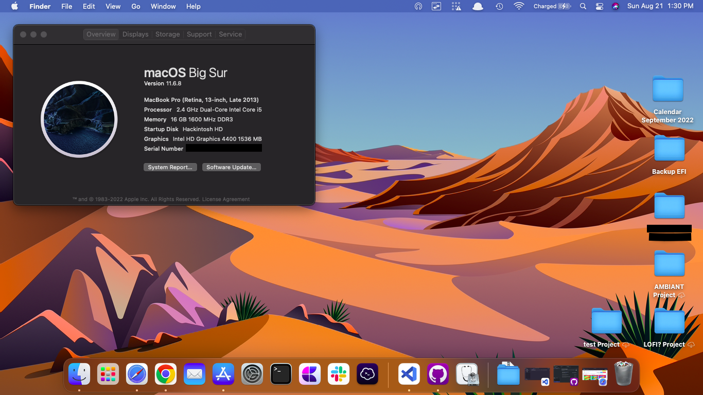

# An Opencore EFI for the Dell 5547 Laptop
An updated version of the Opencore EFI for the [Dell Latitude 5547 by cuong95nddev](https://github.com/cuong95nddev/Dell-5547-Hackintosh-OpenCore)

## Quick Specs
- Opencore 0.8.3 (Latest as of Aug 21, 2022)
- Intel Wireless Card (Intel Wireless 8260)
- i5-4210u (2c/4t)
- 16GB Memory (1600 Mhz, A-Tech)
- Kingston 240GB SSD
- I'm running Big Sur, but this should also work with Catalina
  - I haven't tested Monterey yet, but I will update this if it works

## What works
| Feature | Status | Notes |
| ------------- | ------------- | ------------- |
| **Backlight Controls** | ✅ Working |   |
| **Battery** | ✅ Working | I reccomend using [Apple Juice](https://github.com/raphaelhanneken/apple-juice) |
| **iServices** | ✅ Working | You will have to set up your own iServices, it's easy, see below |
| **All 3 USB Ports** | ✅ Working |   |
| **Keyboard** | ✅ Working |   |
| **Ethernet** | ✅ Working |   |
| **Camera** | ✅ Working |   |
| **HDMI** | ✅ Working |   |
| **Graphics** | ✅ Working | Supposedly, there is a model with a dgpu, so yymv, but this EFI is for the iGPU model |
| **Speakers and Headphones** | ✅ Working |   |
| **WiFi/Bluetooth** | ✅ Working | Uses itlwm, so some setup is required, see below |

## **Critical Notes**
There are 2 Kexts that you should **NEVER** update. Doing so will break built in keyboard support.
- VoodooI2C.kext
- VoodooI2CHID.kext

I have had success updating VoodooPS2Controller.kext but make sure you have a backup first. You can always use your install usb to boot from a "clean" opencore EFI, as OC kexts are only initiated before the boot menu. 

## iServices
In order to activate iServices, you need to provide a serial number, the easiest way I have found is through Opencore Auxilary Tools

1. Download the latest release of OCAT_Mac.dmg [here](https://github.com/ic005k/OCAuxiliaryTools)
2. Extract the app to your downloads folder
3. Open the app and click **Mount ESP** in the top bar
   
    
4. Select the drive you installed MacOS on and enter your password when prompted
5. Navigate to the **PI** tab
6. Next to SystemProductName, click `generate`
7. Click the save button at the top of the screen
8. Reboot

## WiFi

1. Install [Heliport](https://github.com/OpenIntelWireless/HeliPort)
2. Reboot

Note: There is no handoff support in the current configuration. If you need it, either install [AirportItlwm](https://openintelwireless.github.io/itlwm/Installation.html#airportitlwm) (which has [partial support](https://openintelwireless.github.io/itlwm/FAQ.html#does-it-support-apple-s-continuity-framework-airdrop-handoff)) or purchase a [natively supported wifi card](https://dortania.github.io/Wireless-Buyers-Guide/unsupported.html)